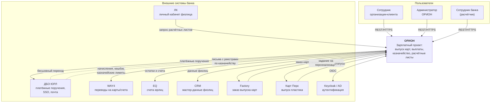

# 01. Контекст системы (C4 Level 1)

## 1.1. Назначение

ОРИОН — зарплатный проект банка. Организация-клиент заключает с банком договор,
после чего через ОРИОН:

1. выпускает зарплатные карты своим сотрудникам (массово или поштучно);
2. формирует платёжные поручения на зарплату, премии и прочие выплаты;
3. ведёт актуальный список сотрудников (приём, увольнение, смена ФИО, архив).

Банк со своей стороны через административный контур ведёт организации и договоры,
согласует заявки клиентов, начисляет кешбэк, управляет казначейскими лимитами
корпоративных карт, организует выдачу пластика и печать документов.

## 1.2. Акторы

| Актор | Контур | Что делает |
|---|---|---|
| Сотрудник организации-клиента | Клиентский | Заявки на выпуск карт, платёжные поручения, ведение сотрудников |
| Уполномоченный нескольких организаций | Клиентский | То же, но в разрезе родительской и дочерних организаций |
| Администратор ОРИОН (операционист банка) | Административный | Согласование заявок, ведение организаций и договоров |
| Администратор-настройщик | Административный | Роли, справочники, шаблоны, календарь, интеграции, оповещения |
| Аудитор / служба безопасности | Административный | Реестр событий, выгрузки |
| Сотрудник банка (расчётчик) | Внутрибанковский | Загрузка данных для расчётных листов |
| Сотрудник банка (получатель) | Внешний, через ЛК | Просмотр своего расчётного листа |
| Курьер / выдающий карты | Административный | Задания на печать, выдача карт |

## 1.3. Внешние системы

| Система | Роль | Направление | Транспорт **[ДОПУЩЕНИЕ]** |
|---|---|---|---|
| **ДБО ЮРЛ** | Дистанционное банковское обслуживание юрлиц. Источник бесшовного перехода; приёмник платёжных поручений; отправитель писем по казначейству | Двустороннее | REST + SSO-токен; входящая почта (IMAP) |
| **WAY4** | Процессинг карт: перевод средств на счета и карты | Исходящее | REST |
| **EQ** | Управление счетами юрлиц: запрос остатков и счетов | Исходящее | REST |
| **ЛК** | Личный кабинет физлица | Входящее (ЛК вызывает ОРИОН) | REST, ОРИОН — провайдер API расчётных листов |
| **CRM** | Мастер-данные физлиц | Двустороннее | REST |
| **Factory** | Обработка заказа на выпуск карт | Исходящее + колбэк статусов | REST |
| **Карт Перс** | Персонализация и выпуск пластика | Исходящее + колбэк статусов | REST |
| **AD** | Каталог сотрудников банка | Входящее для Keycloak | LDAP |
| **SMTP/IMAP** | Почта: приём файлов от ДБО ЮРЛ, отправка уведомлений | Двустороннее | SMTP/IMAP |

> **[ДОПУЩЕНИЕ]** Все интеграции синхронные REST поверх HTTPS с mTLS внутри
> периметра. Для систем, где REST недоступен (типична ситуация для WAY4 и EQ),
> предусмотрен альтернативный адаптер: вызов хранимых процедур в БД или
> файловый обмен — это прямо упомянуто в ТЗ («Модуль синхронизации данных …
> запросы по api или вызов хранимых процедур в БД»). Точные протоколы должны
> быть подтверждены владельцами систем — см. [05-integrations.md](05-integrations.md).

## 1.4. Диаграмма контекста

## 1.5. Глоссарий

| Термин | Значение |
|---|---|
| **Организация** | Юрлицо-клиент банка, заключившее зарплатный договор |
| **Дочерняя организация** | Юрлицо, входящее в холдинг родительской; пользователь может обслуживать обе |
| **Договор** | Карточка договора с юрданными, сканами и набором подключённых продуктов банка |
| **Продукт** | Тарифный/карточный продукт банка, включённый в договор |
| **Сотрудник (Employee)** | Физлицо — работник организации-клиента, держатель зарплатной карты |
| **Заявка (Request)** | Пакет данных от клиента, проходящий согласование администратором |
| **Реестр** | Загружаемый текстовый файл со строками по массиву сотрудников |
| **Строка реестра (RequestItem)** | Одна запись реестра = один сотрудник; имеет собственный статус |
| **Шаблон файла (FileTemplate)** | Настраиваемое описание формата и правил валидации загружаемого файла |
| **Платёжное поручение (PaymentOrder)** | Распоряжение на выплату, уходящее в ДБО ЮРЛ |
| **Казначейство (Treasury)** | Суточный цикл: утреннее пополнение корпоративных карт до фиксированной суммы, вечернее списание остатка |
| **Кешбэк** | Индивидуальная или массовая разовая выплата клиентам через WAY4 |
| **Расчётный лист (Payslip)** | HTML-документ по выплате сотруднику банка, отдаётся в ЛК по API |
| **Задание на печать (PrintJob)** | Пул документов на печать перед выездом на выдачу карт |
| **Календарь рабочих дней** | Настройка дней, когда сервис принимает и обрабатывает операции |
| **Бесшовный переход** | Вход в ОРИОН из ДБО ЮРЛ без повторной аутентификации; сверка по ФИО + ИНН физлица + ИНН компании |

## 1.6. Границы ответственности

ОРИОН **не является**:

- бухгалтерской системой — не рассчитывает суммы зарплат, а принимает готовые реестры;
- процессингом — не проводит транзакции сам, а поручает WAY4 и ДБО ЮРЛ;
- мастером данных физлиц — мастер CRM, ОРИОН ведёт локальную проекцию;
- системой печати — формирует пакеты документов, физическая печать вне контура.
