# 02. Контейнеры (C4 Level 2)

## 2.1. Принципы декомпозиции

Сервисы нарезаны по **бизнес-возможностям**, а не по модулям UI из ТЗ: один модуль
интерфейса может обслуживаться несколькими сервисами, и наоборот. Правила:

1. **БД на сервис.** Никаких перекрёстных обращений к чужим таблицам — только REST или события.
2. **Один владелец данных.** У каждой сущности ровно один сервис-мастер; остальные держат проекции.
3. **Деньги изолированы.** Всё, что порождает движение средств (`payment-svc`, `treasury-svc`),
   имеет идемпотентность, журнал распоряжений и запрет каскадных удалений.
4. **Внешний мир — только через `integration-hub`.** Бизнес-сервисы не знают протоколов WAY4/CRM/Factory.
5. **Согласование вынесено.** Статусные модели и маршруты живут в `workflow-svc`,
   бизнес-сервисы лишь публикуют заявки и реагируют на решения.

## 2.2. Диаграмма контейнеров

```mermaid
graph TB
    subgraph Edge["Периметр"]
        SPA_C["React SPA<br/>клиентский контур"]
        SPA_A["React SPA<br/>админ-контур"]
        BFF_C["bff-client<br/>.NET 10"]
        BFF_A["bff-admin<br/>.NET 10"]
    end

    subgraph Core["Бизнес-сервисы"]
        IAM["iam-svc<br/>пользователи, роли,<br/>SSO-переход, профиль"]
        ORG["org-svc<br/>организации, договоры,<br/>продукты, холдинги"]
        EMP["employee-svc<br/>сотрудники, ПДн,<br/>увольнение, архив"]
        CARD["cards-svc<br/>выпуск, перевыпуск,<br/>выдача карт"]
        PAY["payment-svc<br/>платёжные поручения,<br/>кешбэк, выплаты"]
        TRE["treasury-svc<br/>суточный цикл<br/>корпоративных карт"]
        SLIP["payslip-svc<br/>расчётные листы,<br/>API для ЛК"]
        WF["workflow-svc<br/>статусные модели,<br/>маршруты согласования"]
    end

    subgraph Platform["Платформенные сервисы"]
        FILE["file-svc + worker<br/>загрузка, валидация,<br/>журнал импорта"]
        DOC["document-svc<br/>шаблоны документов,<br/>задания на печать"]
        REF["reference-svc<br/>справочники,<br/>календарь рабочих дней"]
        CONT["content-svc<br/>полезные ресурсы,<br/>оповещения"]
        NOTIF["notification-svc<br/>уведомления, email"]
        AUD["audit-svc<br/>реестр событий"]
        SCHED["scheduler-svc<br/>расписания и таймеры"]
    end

    subgraph Integr["Интеграционный слой"]
        HUB["integration-hub<br/>адаптеры внешних систем"]
        MAIL["mail-worker<br/>IMAP от ДБО ЮРЛ"]
    end

    subgraph Infra["Инфраструктура"]
        PG[("PostgreSQL<br/>схема на сервис")]
        REDIS[("Redis<br/>кеш, локи,<br/>идемпотентность")]
        KAFKA[["Kafka<br/>доменные события"]]
        RMQ[["RabbitMQ<br/>команды воркерам"]]
        S3[("MinIO<br/>файлы")]
        KC["Keycloak"]
    end

    SPA_C --> BFF_C
    SPA_A --> BFF_A
    SPA_C -.OIDC.-> KC
    SPA_A -.OIDC.-> KC

    BFF_C --> IAM & ORG & EMP & CARD & PAY & SLIP & FILE & CONT & REF & NOTIF
    BFF_A --> IAM & ORG & EMP & CARD & PAY & TRE & WF & FILE & DOC & REF & CONT & AUD & NOTIF

    CARD & PAY & TRE & SLIP --> WF
    CARD & PAY & TRE & SLIP & EMP --> HUB
    FILE --> S3
    DOC --> S3
    SLIP --> S3

    Core --> PG
    Platform --> PG
    Core -.-> REDIS
    Core -.-> KAFKA
    Platform -.-> KAFKA
    HUB -.-> RMQ
    FILE -.-> RMQ
    DOC -.-> RMQ
    SCHED -.-> RMQ
    MAIL --> HUB
```

## 2.3. Реестр сервисов

| Сервис | Ответственность | Мастер-данные | Внешние вызовы |
|---|---|---|---|
| **bff-client** | Агрегация API клиентского контура, сессии, CSRF, rate limit | — | — |
| **bff-admin** | То же для админ-контура | — | — |
| **iam-svc** | Пользователи ОРИОН, роли, права, привязка «пользователь ↔ организации», бесшовный переход, профиль и смена пароля | User, Role, Permission, UserOrganization | Keycloak Admin API |
| **org-svc** | Организации, холдинги (родитель/дочерние), договоры, продукты в договорах, сканы, настройки интеграции WAY4 на организацию | Organization, Contract, Product, ContractProduct | — |
| **employee-svc** | Сотрудники организаций, ПДн, смена ФИО, увольнение/архив/удаление, привязка счетов и карт (проекция) | Employee, EmployeeAccount | CRM (через hub) |
| **cards-svc** | Заявки на выпуск карт, автоперевыпуск, выдача карт (адреса офисов, визиты), статусы по каждому сотруднику | CardRequest, CardRequestItem, Card, CardHandover | Factory, Карт Перс, WAY4, CRM (через hub) |
| **payment-svc** | Платёжные поручения (зарплата, премии), кешбэк, массовые и индивидуальные разовые выплаты | PaymentRequest, PaymentOrder, PaymentItem, CashbackCampaign | ДБО ЮРЛ, WAY4 (через hub) |
| **treasury-svc** | Суточный цикл: утреннее пополнение корпоративных карт до лимита, вечернее списание остатка, сверка по письмам ДБО ЮРЛ | TreasuryContract, TreasuryCard, TreasuryDailyCycle, TreasuryOperation | WAY4, EQ (через hub) |
| **payslip-svc** | Расчётные листы: загрузка данных, генерация HTML, хранение, архивация, публичный API для ЛК | PayslipBatch, Payslip | — (потребитель — ЛК) |
| **workflow-svc** | Конфигурируемые статусные модели и маршруты согласования, задачи согласующим, возврат на доработку | WorkflowDefinition, WorkflowInstance, ApprovalTask | — |
| **file-svc** (+ `fileproc-worker`) | Приём файлов, шаблоны форматов, валидация, парсинг в строки, журнал импорта | UploadedFile, FileTemplate, ImportJob, ImportError | MinIO |
| **document-svc** | Редактор шаблонов документов, генерация пакетов, задания на печать | DocumentTemplate, GeneratedDocument, PrintJob | MinIO |
| **reference-svc** | Справочники (регионы, статусы, причины и т.д.), календарь рабочих дней | Dictionary, DictionaryItem, WorkingCalendar | — |
| **content-svc** | Раздел полезных ресурсов, ссылки, оповещения клиентам о техработах | ResourceSection, ResourceLink, Announcement | — |
| **notification-svc** | Уведомления в интерфейсе и по email, шаблоны уведомлений, доставка | Notification, NotificationDelivery | SMTP |
| **audit-svc** | Реестр событий всех действий всех пользователей, неизменяемый журнал, поиск и выгрузка | AuditEvent | — |
| **scheduler-svc** | Расписания: казначейский цикл, синхронизации, автоперевыпуск, ретеншн; сверка с календарём рабочих дней | ScheduleDefinition, ScheduleRun | — |
| **integration-hub** (+ `mail-worker`) | Адаптеры WAY4, EQ, CRM, Factory, Карт Перс, ДБО ЮРЛ; retry, circuit breaker, журнал вызовов, приём почты | IntegrationCall, IntegrationEndpoint, InboundMail | все внешние системы |

## 2.4. Соответствие модулям ТЗ

| Модуль ТЗ | Сервисы |
|---|---|
| Профиль пользователя, смена пароля | `iam-svc` + Keycloak |
| Создание пользователей, ролевая модель | `iam-svc` |
| Загрузка текстовых файлов, форматы, валидация по шаблону | `file-svc` |
| Полезные ресурсы, оповещения | `content-svc` |
| Реестр событий | `audit-svc` |
| Справочники | `reference-svc` |
| Синхронизация данных с внешними системами | `integration-hub` + `scheduler-svc` |
| Журнал импорта файлов | `file-svc` |
| Календарь рабочих дней | `reference-svc` (потребитель — `scheduler-svc`) |
| Организация, договоры, сканы, продукты, интеграция WAY4 | `org-svc` (+ `iam-svc` для заведения пользователей организации) |
| Проверка операций и заявок, согласование по ролям | `workflow-svc` |
| Кешбэк | `payment-svc` |
| Автоперевыпуск карт | `cards-svc` |
| Казначейство (+ почта от ДБО ЮРЛ) | `treasury-svc` + `mail-worker` |
| Выдача карт | `cards-svc` + `notification-svc` |
| Редактор шаблонов | `document-svc` |
| Задание на печать | `document-svc` |
| Бесшовный переход из ДБО ЮРЛ | `iam-svc` |
| Выпуск зарплатных карт (клиент) | `cards-svc` + `file-svc` + `workflow-svc` |
| Начисление зарплаты и премий (клиент) | `payment-svc` + `file-svc` + `workflow-svc` |
| Отображение и ведение сотрудников | `employee-svc` |
| Дочерние организации | `org-svc` + `iam-svc` |
| Смена продуктов в договорах | `org-svc` |
| Расчётные листы | `payslip-svc` |

Ни один модуль ТЗ не остался без владельца.

## 2.5. Деплой-группы и путь внедрения

18 деплоймент-юнитов для системы на ~500 организаций — избыточно на старте.
Целевая нарезка сохраняется, но **на первом этапе сервисы собираются в 9 групп**:
внутри группы — один процесс и одна схема БД, границы модулей уже проведены по
целевым сервисам, поэтому разделение позже сводится к выносу проекта в отдельный
деплой без переписывания кода.

| Группа (этап 1) | Содержит | Целевое разделение |
|---|---|---|
| `orion-gateway` | bff-client, bff-admin | остаётся |
| `orion-iam` | iam-svc | остаётся |
| `orion-org` | org-svc, employee-svc | 2 сервиса |
| `orion-cards` | cards-svc | остаётся |
| `orion-payments` | payment-svc, treasury-svc, payslip-svc | 3 сервиса |
| `orion-workflow` | workflow-svc | остаётся |
| `orion-files` | file-svc, fileproc-worker, document-svc | 3 сервиса |
| `orion-platform` | reference-svc, content-svc, notification-svc, audit-svc, scheduler-svc | 5 сервисов |
| `orion-integration` | integration-hub, mail-worker | 2 сервиса |

**[ДОПУЩЕНИЕ]** Такая поэтапность предложена архитектором. Если команда готова
эксплуатировать полную нарезку сразу — этап 1 пропускается, документы не меняются.

## 2.6. Технологические решения внутри сервиса

| Слой | Выбор |
|---|---|
| Хост | ASP.NET Core 10, Minimal API, `Microsoft.AspNetCore.OpenApi` |
| Организация кода | Vertical Slices + MediatR-подобный пайплайн (валидация, аудит, транзакция, идемпотентность) |
| Доступ к данным | EF Core 10 для доменных агрегатов, Dapper для тяжёлых выборок и батчей |
| Валидация | FluentValidation |
| Брокеры | MassTransit (RabbitMQ) + Confluent.Kafka (события) |
| Планировщик | Quartz.NET с Postgres-хранилищем в `scheduler-svc` |
| Кеш | StackExchange.Redis, `IDistributedCache` + именованные политики |
| Наблюдаемость | OpenTelemetry (traces/metrics/logs), Serilog |
| Тесты | xUnit, Testcontainers (Postgres/Redis/Kafka/RabbitMQ), контрактные тесты на внешние адаптеры |
