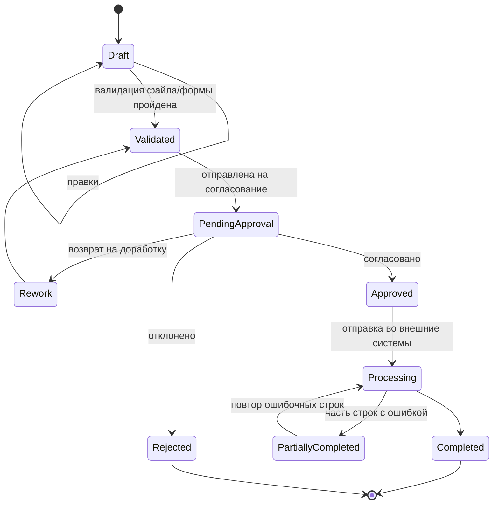
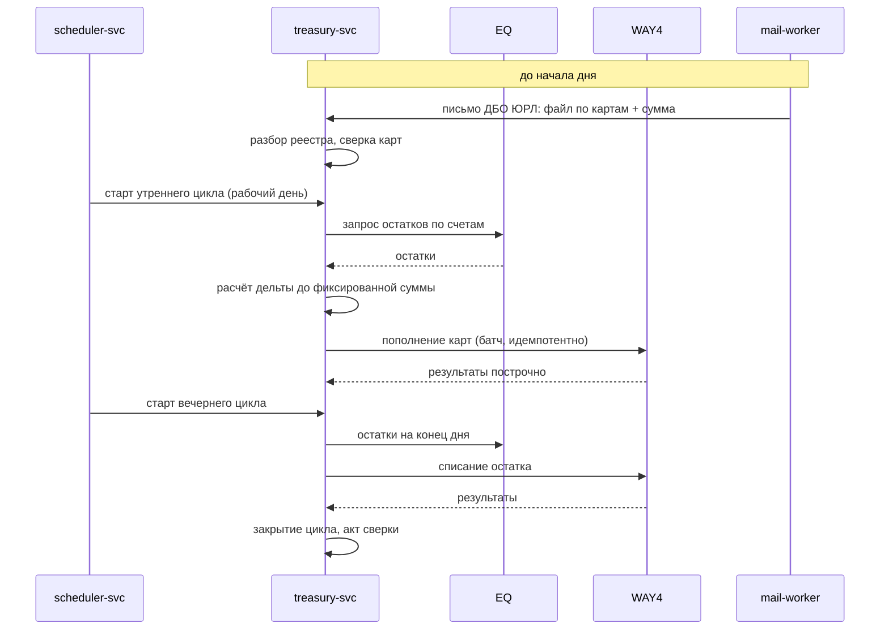
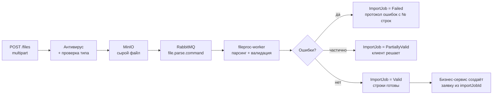

# 03. Домены: ответственность, агрегаты, API

Ниже — по каждому сервису: агрегаты и инварианты, ключевые REST-эндпоинты
(`/api/v1/...`), публикуемые события. Полные схемы таблиц — в [06-data.md](06-data.md),
контракты событий — в [04-messaging.md](04-messaging.md).

---

## 3.1. iam-svc — доступ и идентичность

**Агрегаты:** `User`, `Role`, `Permission`, `UserOrganizationAccess`, `SsoHandoff`.

Keycloak отвечает за аутентификацию (пароль, MFA, сессии, федерация с AD).
ОРИОН отвечает за **авторизацию**: какие права у роли и в каких организациях
действует пользователь. Роли ОРИОН синхронизируются в Keycloak как realm roles,
но источник истины по матрице «роль → права → область действия» — `iam-svc`.

**Инварианты:**
- Пользователь клиентского контура всегда имеет минимум одну организацию в области действия.
- Администратор системы не может иметь клиентские роли одновременно с административными.
- Удаление роли запрещено, если она назначена; допускается только деактивация.
- Изменение прав роли применяется к сессиям не позднее TTL кеша прав (60 с).

**Модель прав.** Гибрид RBAC + ABAC:
- RBAC: `Permission` — атомарное право вида `payment.request.approve`.
- ABAC: `Scope` — область: `Global` | `Organization` | `OrganizationTree` (родитель + дочерние).
Проверка = `permission ∈ role.permissions` **и** `targetOrgId ∈ user.effectiveScope`.

**Ключевые эндпоинты:**
```
POST   /api/v1/users                      создать пользователя
PUT    /api/v1/users/{id}/roles           назначить роли
PUT    /api/v1/users/{id}/organizations   задать область действия
GET    /api/v1/me                         профиль + эффективные права
POST   /api/v1/me/password                смена пароля (проксируется в Keycloak)
POST   /api/v1/roles                      создать роль (набор permissions)
POST   /api/v1/sso/dbo/handoff            приём токена бесшовного перехода из ДБО ЮРЛ
```

**События:** `iam.user.created`, `iam.user.blocked`, `iam.role.changed`, `iam.sso.handoff.succeeded|rejected`.

---

## 3.2. org-svc — организации и договоры

**Агрегаты:** `Organization` (корень), `Contract`, `ContractProduct`, `OrganizationIntegrationSettings`.

**Инварианты:**
- ИНН + КПП организации уникальны в активном состоянии.
- Организация не может быть дочерней сама себе; глубина холдинга ограничена
  (**[ДОПУЩЕНИЕ]** — 2 уровня: родитель + дочерние, как описано в ТЗ).
- У активного договора обязателен минимум один продукт и минимум один скан.
- Смена продукта в договоре не удаляет историю: старая связь закрывается датой.
- Настройки интеграции WAY4 (идентификаторы схем, счета) хранятся на уровне
  организации/договора и версионируются — правки не ломают уже отправленные операции.

**Массовая смена продуктов** (модуль из ТЗ) реализуется как операция
`ProductReplacementJob`: выборка договоров по фильтру → предпросмотр затронутых →
подтверждение → фоновое применение с отчётом. Идемпотентна по `jobId`.

**Ключевые эндпоинты:**
```
POST   /api/v1/organizations
POST   /api/v1/organizations/{id}/children          привязать дочернюю
POST   /api/v1/organizations/{id}/contracts
POST   /api/v1/contracts/{id}/scans                 загрузка скана (file-svc → fileId)
PUT    /api/v1/contracts/{id}/products              состав продуктов
POST   /api/v1/product-replacements                 массовая смена продуктов
GET    /api/v1/product-replacements/{jobId}/preview
PUT    /api/v1/organizations/{id}/integration/way4  настройки WAY4
```

**События:** `org.organization.created|updated|blocked`, `org.contract.activated|terminated`,
`org.product.replaced`, `org.hierarchy.changed`.

---

## 3.3. employee-svc — сотрудники организаций

**Агрегаты:** `Employee`, `EmployeeAccount`, `EmployeeStatusHistory`.

Хранит ПДн физлиц: ФИО, дата рождения, документ, ИНН, СНИЛС, контакты.
Это самый чувствительный сервис — см. [07-security.md](07-security.md).

**Инварианты:**
- Сотрудник всегда принадлежит ровно одной организации. Работа в родительской и
  дочерней — это две записи `Employee`, связанные общим `PersonRef` (ссылка на CRM).
- Дедупликация по (ИНН) либо (ФИО + дата рождения + серия/номер документа);
  при коллизии строка реестра уходит в статус `NeedsReview`, а не создаёт дубль.
- Три исхода вывода сотрудника: `Dismissed` (уволен, данные сохраняются),
  `Archived` (скрыт из рабочих списков), `Deleted` (физическое удаление —
  разрешено только если по сотруднику нет ни одной завершённой денежной операции).
- Смена ФИО версионируется: старое значение сохраняется в истории, событие
  `employee.name.changed` инициирует сверку с CRM и, при наличии карты,
  предложение на перевыпуск в `cards-svc`.

**Ключевые эндпоинты:**
```
GET    /api/v1/organizations/{orgId}/employees      фильтры, пагинация keyset
POST   /api/v1/employees                            ручное заведение
PATCH  /api/v1/employees/{id}                       изменение данных
POST   /api/v1/employees/{id}/dismiss
POST   /api/v1/employees/{id}/archive
DELETE /api/v1/employees/{id}                       с проверкой инварианта
POST   /api/v1/employees/bulk-from-import/{importJobId}
```

**События:** `employee.created`, `employee.updated`, `employee.name.changed`,
`employee.dismissed`, `employee.archived`, `employee.deleted`.

---

## 3.4. cards-svc — карты

**Агрегаты:** `CardRequest` (заявка) → `CardRequestItem` (строка = сотрудник),
`Card`, `CardReissueOffer`, `CardHandover` (выдача).

Заявка — это **сага** с внешними системами: Factory (заказ) → Карт Перс (пластик) →
WAY4 (счёт/карта) → CRM (данные физлица). Каждая строка имеет собственный статус,
клиент видит прогресс построчно — прямое требование ТЗ.

**Статусная модель заявки:**


**Статусы строки:** `Pending` → `SentToFactory` → `InPersonalization` →
`CardIssued` → `AccountOpened` → `Done`; ветки `Failed(reason)` и `Retrying`.

**Инварианты:**
- Заявка неизменяема после `Approved`; исправления — только новой заявкой.
- Повтор строки идемпотентен по `(requestItemId, externalSystem, attemptKey)`.
- Строка не переходит в `Done`, пока не подтверждены и выпуск карты, и открытие счёта.

**Автоперевыпуск** (админский модуль): администратор формирует `CardReissueOffer`
по фильтру (срок действия карты, смена ФИО, износ) → предложение уходит клиенту
как задача в клиентском контуре → клиент подтверждает → создаётся `CardRequest`
типа `Reissue`, проходящий обычное согласование.

**Выдача карт:** администратор задаёт либо адрес офиса, либо визит (дата/время/адрес);
`cards-svc` публикует `cards.handover.scheduled`, `notification-svc` доставляет
уведомление сотруднику организации.

**Ключевые эндпоинты:**
```
POST   /api/v1/card-requests                       из формы или из importJobId
POST   /api/v1/card-requests/{id}/submit           на согласование
GET    /api/v1/card-requests/{id}/items            построчные статусы
POST   /api/v1/card-requests/{id}/items/{itemId}/retry
POST   /api/v1/reissue-offers                      админ: массовое предложение
POST   /api/v1/reissue-offers/{id}/accept          клиент: подтверждение
POST   /api/v1/handovers                           точка/визит выдачи
```

**События:** `cards.request.submitted|approved|rejected`, `cards.item.status.changed`,
`cards.card.issued`, `cards.handover.scheduled`, `cards.reissue.offered`.

---

## 3.5. payment-svc — выплаты

**Агрегаты:** `PaymentRequest` → `PaymentItem`, `PaymentOrder`, `CashbackCampaign`.

Два канала исполнения:
- **Зарплата, премии, прочие выплаты организаций** → ДБО ЮРЛ (платёжное поручение).
- **Кешбэк и разовые выплаты банка** → WAY4 (прямое зачисление на карту/счёт).

Общая доменная модель, разные `PaymentChannel` и адаптеры.

**Инварианты (критичные — это деньги):**
- `PaymentRequest` имеет `IdempotencyKey`, задаваемый клиентом; повторный
  `submit` с тем же ключом возвращает существующую заявку, а не создаёт новую.
- Сумма заявки = сумме строк; расхождение блокирует переход из `Validated`.
- Отправка во внешнюю систему выполняется ровно один раз на строку; повтор
  допускается только после подтверждённого отрицательного статуса от внешней системы.
- Заявка не может быть исполнена в нерабочий день по календарю (`reference-svc`),
  если для типа выплаты не установлен флаг `AllowNonWorkingDay`.
- Отмена возможна только до перехода в `Processing`.
- Любое изменение суммы или получателя после `PendingApproval` сбрасывает согласование.

**Статусная модель** — та же, что у `cards-svc` (общий движок `workflow-svc`),
с дополнительным терминальным `Executed` после подтверждения от ДБО ЮРЛ/WAY4.

**Кешбэк:** `CashbackCampaign` = правило отбора получателей (сегмент клиентов или
явный список) + сумма (фиксированная или по формуле) + период. Массовая кампания
разбивается на пачки по 1000 строк, исполняется через WAY4 с контролем лимита RPS.

**Ключевые эндпоинты:**
```
POST   /api/v1/payment-requests                    Idempotency-Key обязателен
POST   /api/v1/payment-requests/{id}/submit
GET    /api/v1/payment-requests/{id}/items
POST   /api/v1/payment-requests/{id}/cancel
POST   /api/v1/cashback-campaigns
POST   /api/v1/cashback-campaigns/{id}/launch
GET    /api/v1/payment-orders/{id}                 статус в ДБО ЮРЛ
```

**События:** `payment.request.submitted|approved|executed|failed`,
`payment.item.status.changed`, `payment.cashback.campaign.launched`.

---

## 3.6. treasury-svc — казначейство

**Агрегаты:** `TreasuryContract` (юрлицо + правила), `TreasuryCard`,
`TreasuryDailyCycle`, `TreasuryOperation`, `InboundRegistry`.

Суточный цикл по каждому казначейскому договору:



**Инварианты:**
- Один `TreasuryDailyCycle` на договор на дату — уникальный индекс `(contractId, businessDate)`.
- Цикл не стартует в нерабочий день (календарь `reference-svc`), кроме ручного запуска
  администратором с обоснованием — попадает в аудит.
- Каждая `TreasuryOperation` идемпотентна по `(cycleId, cardId, operationType)`.
- Вечернее списание не выполняется, пока утреннее пополнение не в терминальном статусе.
- Незакрытый цикл предыдущего дня блокирует старт нового и поднимает алерт.
- Расхождение между суммой из письма ДБО ЮРЛ и фактически зачисленным фиксируется
  как `Discrepancy` и требует ручного разбора — автосписание при этом останавливается.

**Ключевые эндпоинты:**
```
POST   /api/v1/treasury/contracts
GET    /api/v1/treasury/cycles?date=&contractId=
POST   /api/v1/treasury/cycles/{id}/run-morning     ручной запуск
POST   /api/v1/treasury/cycles/{id}/run-evening
POST   /api/v1/treasury/cycles/{id}/close
GET    /api/v1/treasury/discrepancies
```

**События:** `treasury.cycle.started|completed|failed`, `treasury.discrepancy.detected`,
`treasury.registry.received`.

---

## 3.7. workflow-svc — согласования

**Агрегаты:** `WorkflowDefinition` (тип заявки → шаги), `WorkflowInstance`, `ApprovalTask`.

Конфигурируется администратором без разработки:

```
WorkflowDefinition {
  entityType: CardRequest | PaymentRequest | ProductReplacement | ...
  conditions: [ { field: "amount", op: ">", value: 1000000 } ]   // маршрутизация
  steps: [
    { order: 1, name: "Операционист", roles: ["ops"], quorum: Any,  slaHours: 4 },
    { order: 2, name: "Контролёр",    roles: ["ctrl"], quorum: All, slaHours: 8,
      condition: "amount > 1000000" }
  ]
  onReject: ReturnToAuthor
  onTimeout: Escalate | Notify
}
```

**Инварианты:**
- Решение по задаче принимает только пользователь с ролью шага и областью действия,
  покрывающей организацию заявки.
- Автор заявки не может её согласовать (**[ДОПУЩЕНИЕ]** — принцип четырёх глаз;
  подтвердить у заказчика, допускается ли исключение).
- Возврат на доработку сбрасывает пройденные шаги.
- Изменение `WorkflowDefinition` не влияет на уже запущенные экземпляры —
  экземпляр фиксирует версию определения.

**Ключевые эндпоинты:**
```
POST   /api/v1/workflow-definitions
POST   /api/v1/workflow-instances                  запуск процесса бизнес-сервисом
GET    /api/v1/approval-tasks?assignedToMe=true
POST   /api/v1/approval-tasks/{id}/approve
POST   /api/v1/approval-tasks/{id}/reject
POST   /api/v1/approval-tasks/{id}/return          на доработку с комментарием
```

**События:** `workflow.instance.started`, `workflow.step.completed`,
`workflow.instance.approved|rejected|returned`.

---

## 3.8. file-svc — файлы, шаблоны, импорт

**Агрегаты:** `FileTemplate`, `UploadedFile`, `ImportJob`, `ImportRow`, `ImportError`.

**Шаблон файла** — настраиваемое администратором описание:
формат (CSV/TXT с разделителем/фиксированная ширина/XLSX **[ДОПУЩЕНИЕ]** —
ТЗ говорит «текстовые файлы», уточнить, нужен ли Excel), кодировка (UTF-8, CP1251),
разделитель, наличие заголовка, список колонок с типом, обязательностью,
маской и правилом проверки, а также кросс-полевые правила.

**Конвейер импорта:**


**Инварианты:**
- Файл не удаляется, пока существует ссылающийся на него `ImportJob` или заявка.
- Повторная загрузка идентичного файла (SHA-256) в ту же организацию за сутки
  требует явного подтверждения — защита от двойной отправки реестра.
- Протокол ошибок содержит номер строки, колонку, значение, код и текст правила
  и доступен на выгрузку.

**Ключевые эндпоинты:**
```
POST   /api/v1/files                              загрузка (multipart, до 100 МБ)
GET    /api/v1/files/{id}/download                presigned URL
POST   /api/v1/file-templates
POST   /api/v1/file-templates/{id}/validate       пробный прогон
GET    /api/v1/import-jobs?organizationId=        журнал импорта
GET    /api/v1/import-jobs/{id}/errors            протокол
```

**События:** `file.uploaded`, `file.import.completed|failed`.

---

## 3.9. payslip-svc — расчётные листы

**Агрегаты:** `PayslipBatch`, `Payslip`.

Контур сотрудников самого банка. Расчётчик загружает файл по шаблону →
формируются платёжные поручения (передаются в `payment-svc`) и HTML-расчётные
листы по каждому сотруднику → ЛК получает их по API.

**Инварианты:**
- Расчётный лист неизменяем после публикации; исправление — новая версия с признаком
  `supersedes` и сохранением предыдущей.
- API для ЛК отдаёт только листы конкретного физлица; авторизация — по
  подтверждённому идентификатору физлица (**[ДОПУЩЕНИЕ]**: service-to-service
  токен ЛК + `personId`; уточнить, чем ЛК идентифицирует сотрудника —
  табельный номер, ИНН или внутренний ID CRM).
- Архивация и удаление — по политике ретеншна и по признаку увольнения.

**Ключевые эндпоинты:**
```
POST   /api/v1/payslip-batches                    из importJobId
POST   /api/v1/payslip-batches/{id}/publish
GET    /api/v1/payslips?personId=&period=         внутренний
GET    /api/v1/public/payslips                    для ЛК (отдельный host, mTLS)
POST   /api/v1/payslips/archive                   массовая архивация
```

**События:** `payslip.batch.published`, `payslip.archived`.

---

## 3.10. Платформенные сервисы — кратко

| Сервис | Ключевое |
|---|---|
| **reference-svc** | Справочники с версионированием и признаком системный/пользовательский; календарь рабочих дней с типами дней (рабочий, выходной, сокращённый, техработы). Отдаёт данные по REST и реплицирует изменения в Kafka — остальные сервисы держат кеш в Redis. |
| **content-svc** | Разделы полезных ресурсов, ссылки, вложения; оповещения с периодом показа, аудиторией (все / организация / роль) и уровнем (info/warning/critical). |
| **notification-svc** | Единая точка доставки: in-app (счётчик, лента), email. Шаблоны с подстановками, дедупликация, история доставки, повторы. |
| **audit-svc** | Append-only журнал: `who, when, what, where (сервис), targetType, targetId, before, after, correlationId, ip, userAgent, result`. Записи не редактируются и не удаляются; ретеншн — переезд в холодное хранилище. Пишется асинхронно через Kafka, чтобы не влиять на латентность операций. |
| **scheduler-svc** | Расписания на Quartz.NET: казначейские циклы, синхронизации с внешними системами, автоперевыпуск, ретеншн, отчёты. Перед запуском сверяется с календарём рабочих дней. Публикует команды в RabbitMQ, сам бизнес-логику не выполняет. |
| **document-svc** | Редактор шаблонов документов (плейсхолдеры, условные блоки, таблицы), генерация DOCX/PDF/HTML, сборка `PrintJob` — пула документов на печать перед выездом на выдачу карт. |
| **integration-hub** | Адаптер на внешнюю систему, единый журнал вызовов, политики retry/backoff, circuit breaker, таймауты, маппинг ошибок в доменные коды. Секреты — из sealed secrets. |
