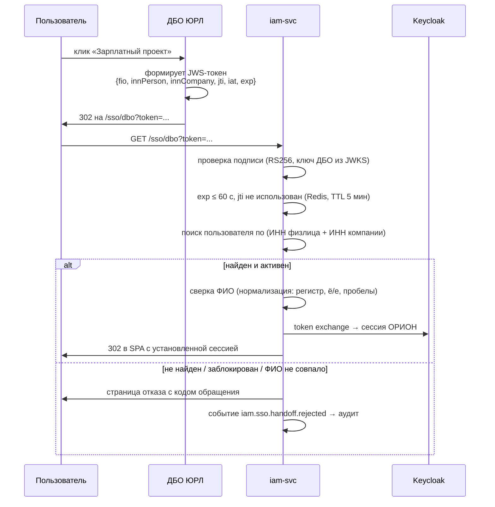

# 05. Интеграции с внешними системами

## 5.1. Общие принципы

Все внешние вызовы идут через `integration-hub`. Бизнес-сервис отправляет команду
в RabbitMQ и получает результат событием — синхронно во внешние системы
бизнес-сервисы не ходят никогда. Исключение — редкие справочные запросы
(например, проверка счёта при вводе формы), для них hub предоставляет
синхронный REST с жёстким таймаутом 3 с.

**Обязательные атрибуты каждого адаптера:**

| Механизм | Настройка |
|---|---|
| Таймаут | connect 3 с, request 30 с (батчи — 300 с) |
| Повторы | 3 попытки, экспоненциальный backoff с джиттером; только для идемпотентных операций и сетевых ошибок |
| Circuit breaker | 50% ошибок на окне 30 с → размыкание на 60 с |
| Bulkhead | Отдельный пул соединений на систему; отказ WAY4 не блокирует CRM |
| Идемпотентность | `X-Idempotency-Key` = детерминированный ключ из доменного идентификатора |
| Журнал | Каждый вызов в `integration_calls`: запрос, ответ, длительность, код, correlationId. ПДн и номера карт маскируются |
| Трассировка | `traceparent` пробрасывается, если принимающая система поддерживает |
| Безопасность | mTLS + OAuth2 client credentials **[ДОПУЩЕНИЕ]**, секреты из sealed secrets |

## 5.2. Матрица интеграций

| Система | Операции | Направление | Критичность | Режим при отказе |
|---|---|---|---|---|
| **ДБО ЮРЛ** | SSO-переход; отправка платёжных поручений; статусы; входящие письма с реестрами | ↔ | Критичная | Заявки копятся в `Approved`, отправка возобновляется после восстановления |
| **WAY4** | Перевод на карту/счёт; открытие счёта; кешбэк; казначейские пополнения и списания; статус карты | → | Критичная | Казначейский цикл не закрывается, алерт дежурному |
| **EQ** | Остатки и реквизиты счетов юрлиц | → | Высокая | Казначейский расчёт откладывается, цикл в `Waiting` |
| **CRM** | Поиск/создание физлица, актуализация данных | ↔ | Высокая | Строка заявки в `Retrying`, заявка не отклоняется |
| **Factory** | Заказ выпуска карт, колбэк статусов | → + колбэк | Высокая | Повторы, затем задача администратору |
| **Карт Перс** | Задание на персонализацию, колбэк готовности | → + колбэк | Средняя | Повторы |
| **ЛК** | Отдаём расчётные листы по API | ← | Средняя | Деградация только на стороне ЛК |
| **AD** | Аутентификация сотрудников банка | ← через Keycloak | Высокая | Локальные учётки администраторов как резерв |
| **SMTP/IMAP** | Уведомления, приём реестров казначейства | ↔ | Средняя | Очередь уведомлений копится; для IMAP — алерт о непоступлении письма к контрольному времени |

## 5.3. Бесшовный переход из ДБО ЮРЛ

Требование ТЗ: сверка по ФИО пользователя, ИНН пользователя и ИНН компании.

**Рекомендуемый вариант — OIDC**: ДБО ЮРЛ и ОРИОН — клиенты одного Keycloak,
переход = редирект с уже существующей SSO-сессией. Требует, чтобы ДБО ЮРЛ
аутентифицировался через тот же realm.

**Вариант при невозможности OIDC — подписанный одноразовый токен:**



**Защита:** окно жизни токена 60 с, одноразовость по `jti`, привязка к
IP-подсети **[ДОПУЩЕНИЕ]**, обязательный аудит каждой попытки — успешной и нет.

**Открытый вопрос:** совпадение ФИО — ненадёжный ключ (двойные фамилии, ё/е,
смена фамилии). Предлагается считать основным ключом пару ИНН физлица + ИНН
компании, а ФИО использовать как контрольную сверку с логированием расхождений,
но без блокировки входа при расхождении только в регистре/дефисах. Требует
подтверждения службы безопасности.

## 5.4. WAY4 — самая нагруженная интеграция

Операции: `TransferToCard`, `TransferToAccount`, `OpenAccount`, `LinkCard`,
`GetCardStatus`, `TreasuryTopUp`, `TreasurySweep`.

**Особенности:**
- Настройки WAY4 задаются **на организацию/договор** (ТЗ: «Настраивают интеграции
  с другими системами WAY4») — идентификаторы схем, счета списания, продуктовые коды.
  Хранятся в `org-svc`, hub получает их вместе с командой, а не хранит у себя.
- Массовые операции (кешбэк, казначейство) отправляются пачками; размер пачки
  и RPS настраиваются на систему, по умолчанию 1000 строк и 20 RPS **[ДОПУЩЕНИЕ]**.
- Результат по каждой строке — отдельное событие `orion.integration.callback.v1`.
- Ключ идемпотентности: `sha256(operationType + entityId + businessDate)`.

**Открытый вопрос:** поддерживает ли WAY4 идемпотентность на своей стороне.
Если нет — перед повтором обязателен запрос статуса операции, иначе есть риск
двойного зачисления. Это блокирующий вопрос для модуля кешбэка и казначейства.

## 5.5. Почтовый канал казначейства

ТЗ: «Модуль почты — через него получаем на наш почтовый ящик письмо от ДБО ЮРЛ
файл по картам и сумма для зачисления».

`mail-worker` опрашивает IMAP-ящик (интервал 1 мин), для каждого письма:

1. Проверка отправителя по белому списку и подписи (S/MIME, если применяется).
2. Извлечение вложения, антивирусная проверка, сохранение в MinIO.
3. Разбор по шаблону через `file-svc`.
4. Создание `InboundRegistry` в `treasury-svc`, сверка суммы из тела письма
   с суммой строк файла.
5. Письмо помечается обработанным (перемещается в папку `Processed`);
   идемпотентность по `Message-ID`.

**Контроль:** если к контрольному времени (**[ДОПУЩЕНИЕ]** — 08:00) письмо
не поступило, поднимается алерт и утренний цикл не стартует автоматически.

## 5.6. API для ЛК (расчётные листы)

ОРИОН выступает провайдером. Отдельный host `payslip-public`, доступен только
из сети ЛК, mTLS + OAuth2 client credentials, rate limit на клиента.

```
GET /api/v1/public/payslips?personId={id}&from=2026-01&to=2026-09
GET /api/v1/public/payslips/{id}/html
```

Ответ не содержит данных других физлиц; каждый запрос пишется в аудит.

## 5.7. Модуль синхронизации данных (админский)

ТЗ допускает «запросы по api или вызов хранимых процедур в БД». В `integration-hub`
это `IntegrationEndpoint` с типом `Rest` | `StoredProcedure` | `FileExchange`,
расписанием, маппингом полей и режимом (полная выгрузка / инкремент по метке времени).
Администратор настраивает эндпоинты в UI, `scheduler-svc` запускает по расписанию,
каждый прогон фиксируется с числом обработанных и ошибочных записей.

> Вызов хранимых процедур в чужой БД — сознательный компромисс ради
> совместимости с унаследованными системами. Ограничения: только выделенная
> учётная запись с правами на конкретные процедуры, только через `integration-hub`,
> обязательный таймаут и журнал. Прямой доступ бизнес-сервисов к внешним БД запрещён.
