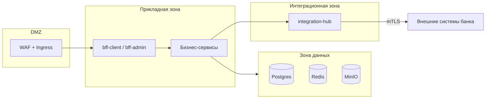

# 07. Безопасность

Система оперирует персональными данными физлиц и распоряжениями на движение
денежных средств. Это определяет требования: сегментация контуров, минимизация
ПДн, полный аудит, принцип четырёх глаз на деньгах.

## 7.1. Аутентификация

**Keycloak** — единый IdP, отдельные realm-клиенты на контур:

| Клиент | Контур | Поток | MFA |
|---|---|---|---|
| `orion-client-spa` | Клиентский | Authorization Code + PKCE | По политике организации **[ДОПУЩЕНИЕ]** |
| `orion-admin-spa` | Административный | Authorization Code + PKCE | Обязательна |
| `orion-lk-api` | ЛК → ОРИОН | Client Credentials + mTLS | — |
| `orion-service-*` | Сервис ↔ сервис | Client Credentials | — |

**Токены:** access — 15 мин, refresh — 8 ч (клиент) / 4 ч (админ), скользящее
продление, привязка к отпечатку клиента. SPA не хранит токены в `localStorage`:
`bff-*` работает по паттерну BFF — refresh-токен в httpOnly Secure SameSite=Strict
cookie, access-токен наружу не отдаётся.

**Смена пароля** — модуль профиля из ТЗ: `iam-svc` проксирует в Keycloak Account API,
политика (длина, сложность, история, срок действия) задаётся в Keycloak,
событие смены уходит в аудит.

**Федерация с AD** — для сотрудников банка (административный и внутрибанковский
контуры). Клиентские пользователи заводятся администратором в ОРИОН, учётка
создаётся в Keycloak через Admin API.

## 7.2. Авторизация

Двухуровневая проверка на каждом запросе:

1. **Право (RBAC):** `permission` вида `<домен>.<сущность>.<действие>`, например
   `payment.request.approve`, `org.contract.edit`, `employee.pd.view`.
2. **Область (ABAC):** `Global` | `Organization` | `OrganizationTree`.

```csharp
// Пайплайн: единая точка, обойти нельзя
[RequirePermission("payment.request.approve", Scope = ScopeKind.Organization)]
public async Task<Result> Handle(ApproveRequest cmd, CancellationToken ct)
```

Область берётся из ресурса (`organizationId` заявки), а не из запроса — иначе
пользователь мог бы подменить область в теле.

**Сотрудник нескольких организаций** (родительская + дочерние): в токене список
`orgIds`, при `OrganizationTree` доступ распространяется на дочерние через
проекцию иерархии из `org-svc`. Активная организация выбирается в UI и передаётся
заголовком `X-Organization-Id`, но всегда сверяется с областью пользователя.

**Изоляция арендаторов на уровне БД.** Прикладной проверки недостаточно —
включается Row Level Security:

```sql
ALTER TABLE employees ENABLE ROW LEVEL SECURITY;
CREATE POLICY p_emp_tenant ON employees
    USING (organization_id = ANY (string_to_array(
           current_setting('app.org_ids', true), ',')::uuid[]));
```

Сервис устанавливает `app.org_ids` в начале транзакции. Ошибка в коде запроса
не приводит к утечке данных чужой организации.

## 7.3. Персональные данные

| Категория | Где | Защита |
|---|---|---|
| ФИО, дата рождения, документ, ИНН, СНИЛС | `employee-svc` | Шифрование колонок документа и СНИЛС (`pgcrypto`, ключ в Vault/sealed secret); RLS; отдельное право `employee.pd.view` |
| Номер счёта | `employee-svc`, `payment-svc` | Маскирование в UI и логах, полный номер — по праву |
| Номер карты (PAN) | **не хранится** | Только маска `4276****1234`, полученная от WAY4 |
| Суммы выплат | `payment-svc`, `payslip-svc` | Доступ по области действия; в логах не пишутся |
| Расчётные листы | `payslip-svc`, MinIO | Доступ только владельцу через ЛК и уполномоченным расчётчикам |

**Правила:**
- ПДн не передаются в событиях Kafka — только идентификаторы.
- ПДн не пишутся в логи: маскирующий обогатитель Serilog по списку полей,
  нарушение ловится тестом на конвейере сборки.
- В нижних средах — обезличенные данные; выгрузка боевых данных в тест запрещена
  без обезличивания.
- Экспорт списков сотрудников — отдельное право, каждая выгрузка в аудите
  с числом строк.
- PAN не проходит через ОРИОН — это выводит систему из области хранения
  карточных данных, что нужно подтвердить со службой ИБ.

## 7.4. Защита денежных операций

| Механизм | Реализация |
|---|---|
| Четыре глаза | Автор заявки не может её согласовать; для сумм выше порога — второй согласующий (`workflow-svc`) |
| Идемпотентность | `Idempotency-Key` на создание заявки, детерминированный ключ на каждый внешний вызов |
| Лимиты | Лимит на заявку и суточный лимит на организацию **[ДОПУЩЕНИЕ]** — требует подтверждения |
| Контроль рабочего дня | Исполнение только в рабочий день по календарю |
| Неизменяемость | После `Approved` заявка не редактируется; правка суммы или получателя до согласования сбрасывает маршрут |
| Сверка | Ежедневная сверка отправленного и подтверждённого; расхождения — в отчёт и алерт |
| Аудит | Полный: кто, когда, что, до/после, IP, correlationId |

## 7.5. Реестр событий (требование ТЗ)

`audit-svc` фиксирует **все действия всех пользователей**: вход, выход, отказ в
доступе, просмотр ПДн, любое изменение данных, согласование, выгрузку, вызовы
внешних систем, административные настройки.

Свойства: append-only (нет прав на UPDATE/DELETE), асинхронная запись через
Kafka (недоступность аудита не роняет операцию, но копится в outbox),
корреляция сквозным `correlationId`, поиск по пользователю/организации/объекту/периоду,
выгрузка в CSV и XLSX по праву аудитора.

## 7.6. Сетевая безопасность



- Клиентский контур публикуется отдельно от административного;
  админ-контур доступен только из внутренней сети банка **[ДОПУЩЕНИЕ]**.
- NetworkPolicy в Kubernetes: явный список разрешённых связей, всё остальное запрещено.
- Только `integration-hub` имеет сетевой доступ наружу.
- Секреты — sealed secrets / Vault, в образах и переменных окружения не хранятся.

## 7.7. Прикладная защита

- Загружаемые файлы: проверка расширения и сигнатуры, антивирус (ICAP), лимит
  размера, запрет исполняемых типов, изоляция парсинга в воркере без доступа наружу.
- Шаблоны документов: движок без выполнения произвольного кода, только подстановки
  и условия — иначе редактор шаблонов становится вектором RCE.
- REST: rate limit на пользователя и на клиента, защита от массового перебора
  идентификаторов, пагинация с keyset вместо offset.
- CSRF: SameSite cookie + токен на изменяющих запросах в BFF.
- Заголовки: CSP, HSTS, X-Content-Type-Options, Referrer-Policy.
- Зависимости: SCA на конвейере, запрет сборки при критических уязвимостях.
