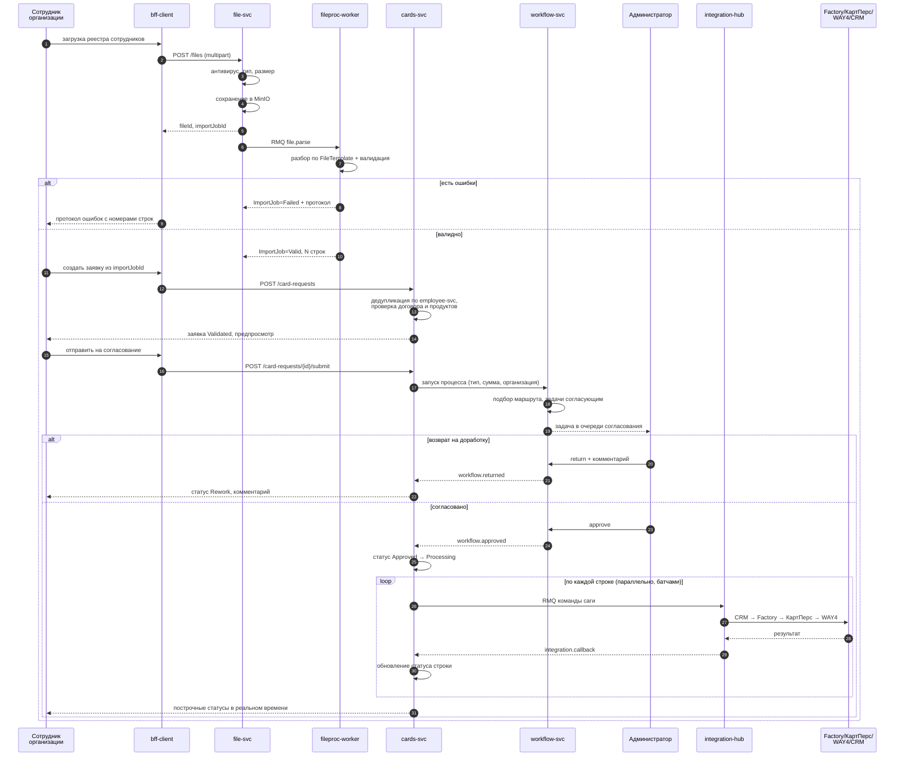
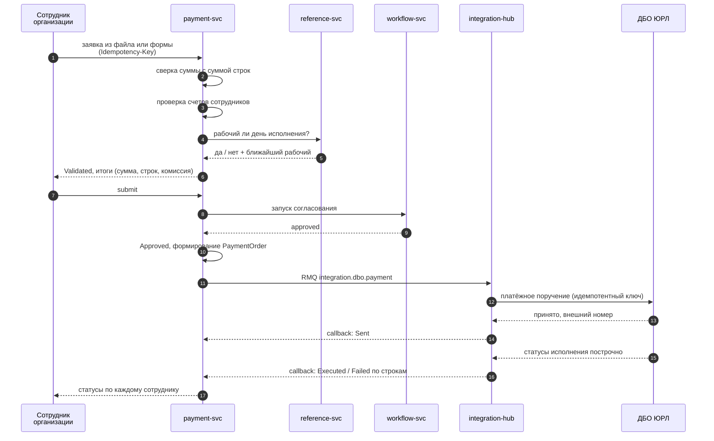
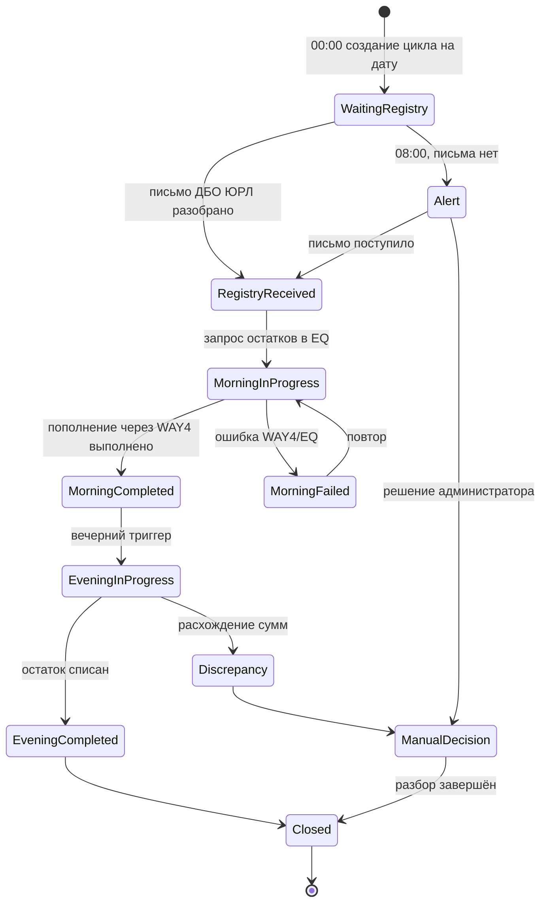
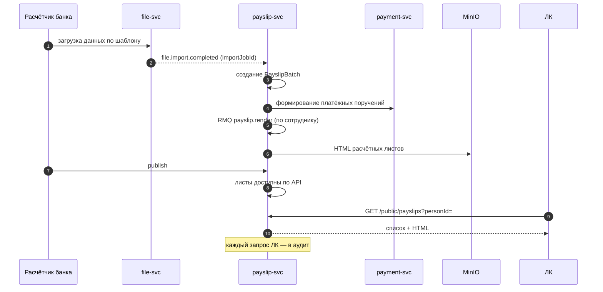

# 08. Ключевые сценарии

## 8.1. Массовый выпуск карт из файла

Самый показательный сценарий: объединяет загрузку файла, валидацию, согласование,
сагу с четырьмя внешними системами и построчные статусы.

**Отказ на шаге саги:** строка переходит в `Retrying`, повтор по политике;
после исчерпания — `Failed` с кодом ошибки, задача администратору, ручное
решение (повтор или компенсация). Успешные строки не откатываются — заявка
завершается в статусе `PartiallyCompleted`, что видно клиенту построчно.

## 8.2. Начисление зарплаты

**Критично:** после отправки в ДБО ЮРЛ автоматического отката нет. Все проверки
(рабочий день, лимиты, корректность счетов, отсутствие дубля по
`Idempotency-Key`) выполняются до отправки. Повторная отправка возможна только
после явного подтверждённого отказа от ДБО ЮРЛ.

## 8.3. Казначейский суточный цикл

Незакрытый цикл блокирует создание цикла следующего дня — это защита от
наложения операций и потери контроля над остатками.

## 8.4. Бесшовный переход из ДБО ЮРЛ

Диаграмма — в [05-integrations.md](05-integrations.md), раздел 5.3.

## 8.5. Расчётные листы

## 8.6. Выдача карт

1. Карты изготовлены → `cards.card.issued`.
2. Администратор создаёт точку выдачи (адрес офиса) или визит (дата, время, адрес).
3. `cards.handover.scheduled` → `notification-svc` → уведомление сотруднику
   организации в интерфейсе (и по email, если включено).
4. Перед визитом формируется `PrintJob`: пакет документов на подпись
   (`document-svc` по шаблонам) → печать.
5. Факт выдачи фиксируется, статус карты → `Handed`, событие в аудит.

## 8.7. Массовая смена продуктов в договорах

1. Администратор задаёт фильтр (организация, продукт-источник, продукт-приёмник, дата).
2. Предпросмотр: сколько договоров и сотрудников затронуто, какие конфликты.
3. Подтверждение → фоновое применение батчами, идемпотентно по `jobId`.
4. Отчёт: применено, пропущено (с причинами), ошибки.
5. Событие `org.product.replaced` → потребители обновляют проекции.

Операция не изменяет уже исполненные заявки и не переоформляет выпущенные карты —
только состав продуктов в договоре, с закрытием прежней связи датой.
