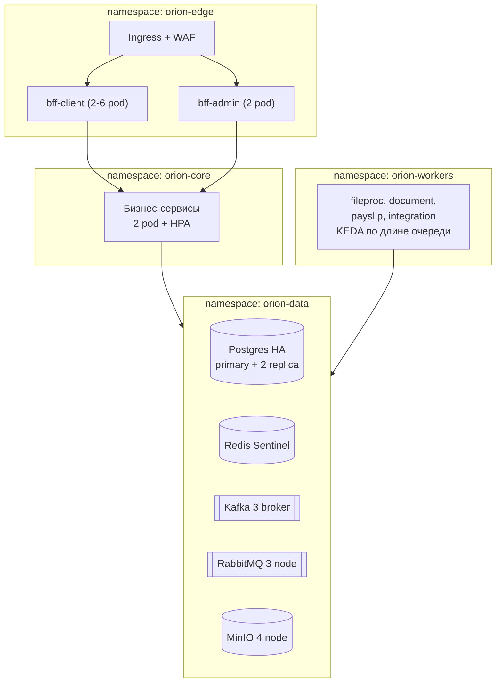

# 09. Нефункциональные требования и эксплуатация

## 9.1. Целевые показатели

Значения ниже — **предложение архитектора [ДОПУЩЕНИЕ]**, подлежат согласованию
с заказчиком и фиксации в SLA.

| Показатель | Целевое значение |
|---|---|
| Доступность клиентского контура | 99,5% в рабочие дни 06:00–22:00 |
| Доступность админ-контура | 99,0% в рабочее время |
| Отклик REST (p95) | ≤ 500 мс на чтение, ≤ 1 с на запись |
| Отклик списков с фильтрами (p95) | ≤ 800 мс на 100 тыс. записей |
| Загрузка и валидация реестра 10 тыс. строк | ≤ 2 мин |
| Отправка заявки из 10 тыс. строк во внешние системы | ≤ 30 мин (ограничение — RPS внешних систем) |
| Казначейский утренний цикл | завершён до 09:00 |
| RPO | 15 мин |
| RTO | 2 ч |
| Одновременных пользователей | 300 (пик в дни выплат) |
| Хранение аудита | 3 года онлайн |

**Профиль нагрузки:** резко неравномерный. 5-е и 20-е числа дают до 70% месячного
объёма выплат. Ёмкость планируется по пику, не по среднему; воркеры масштабируются
по длине очереди RabbitMQ (KEDA).

## 9.2. Kubernetes



| Аспект | Решение |
|---|---|
| Пакетирование | Helm-чарт на сервис + зонтичный чарт окружения |
| Конфигурация | ConfigMap на окружение, секреты — sealed secrets/Vault |
| Масштабирование | HPA по CPU и RPS для API; KEDA по длине очереди для воркеров |
| Проверки | `/health/live`, `/health/ready` (с проверкой БД и брокеров), `/health/startup` |
| Обновление | Rolling update, `maxUnavailable: 0`; для схемы БД — expand/contract |
| Устойчивость | PodDisruptionBudget, anti-affinity по узлам, requests/limits на всех подах |
| Изоляция | NetworkPolicy: явные разрешения, deny by default |

**Совместимость миграций.** Схема БД меняется по expand/contract: сначала
добавляем совместимые изменения, затем деплоим код, затем удаляем старое.
Это позволяет катить обновление без остановки и откатываться на предыдущую версию.

## 9.3. Наблюдаемость

| Слой | Инструмент | Что смотрим |
|---|---|---|
| Логи | Serilog → JSON → Loki/ELK | Структурированные, с `correlationId`, ПДн замаскированы |
| Метрики | OpenTelemetry → Prometheus | RED по эндпоинтам, длины очередей, лаг Kafka, размер outbox |
| Трассировки | OpenTelemetry → Tempo/Jaeger | Сквозной путь запроса, включая внешние вызовы |
| Дашборды | Grafana | Технические + бизнес-панели |
| Алерты | Alertmanager | См. ниже |

**Бизнес-метрики (важнее технических для этой системы):**

- заявок в статусе `PendingApproval` дольше SLA согласования;
- строк в `Failed` за последний час по каждой внешней системе;
- казначейские циклы, не закрытые к контрольному времени;
- расхождения сумм в казначействе;
- необработанные письма в IMAP-ящике;
- размер `outbox_messages` без `published_at` (растёт → брокер недоступен);
- глубина DLQ по каждой очереди;
- отказы бесшовного перехода из ДБО ЮРЛ.

**Критические алерты (дежурному):** казначейский цикл не завершён к 09:00;
DLQ непуста; outbox > 1000 сообщений 5 мин; недоступность WAY4 или ДБО ЮРЛ > 5 мин;
рост ошибок 5xx > 1% за 5 мин; лаг Kafka-консьюмера > 10 тыс.

## 9.4. Отказоустойчивость

| Компонент | Отказ | Поведение системы |
|---|---|---|
| Реплика сервиса | Под упал | Трафик на оставшиеся, HPA поднимает новый |
| Postgres primary | Отказ узла | Автоматический failover (Patroni), простой ≤ 60 с |
| Redis | Недоступен | Работа продолжается без кеша, латентность растёт; операции, требующие лока (казначейство), откладываются |
| Kafka | Недоступна | События копятся в outbox, публикуются после восстановления |
| RabbitMQ | Недоступен | Команды не отправляются; API остаётся доступным на чтение |
| MinIO | Недоступен | Загрузка файлов блокируется, остальная работа продолжается |
| Внешняя система | Недоступна | Circuit breaker, повторы, заявки в `Retrying`; клиент видит статус ожидания, а не ошибку |
| Keycloak | Недоступен | Новые входы невозможны, действующие сессии живут до истечения токена |

**Принцип деградации:** отказ внешней системы никогда не приводит к потере или
искажению заявки. Заявка остаётся в согласованном состоянии и продолжает
обработку после восстановления.

## 9.5. Резервное копирование

| Данные | Метод | Частота | Хранение |
|---|---|---|---|
| Postgres | pgBackRest: полный + WAL | Полный еженедельно, WAL непрерывно | 30 дней, PITR |
| MinIO | Репликация в резервный кластер | Непрерывно | 90 дней версий |
| Kafka | Не бэкапится (не источник истины) | — | — |
| Redis | Не бэкапится (кеш) | — | — |
| Конфигурация k8s | Git (GitOps) | При изменении | Вся история |
| Секреты | Vault со своим бэкапом | Ежедневно | 90 дней |

Восстановление проверяется учениями не реже раза в квартал; без проверки бэкап
считается несуществующим.

## 9.6. Среды

| Среда | Назначение | Данные | Внешние системы |
|---|---|---|---|
| `dev` | Разработка | Синтетические | Заглушки (WireMock) |
| `test` | Автотесты, контрактные тесты | Синтетические | Заглушки + Testcontainers |
| `stage` | Приёмка, нагрузочное | Обезличенная копия | Тестовые контуры банка |
| `prod` | Промышленная | Боевые | Боевые |

Выгрузка боевых данных в нижние среды без обезличивания запрещена.

## 9.7. Конвейер сборки и поставки

```
commit → сборка → unit-тесты → анализ кода (SonarQube) → SCA (уязвимости)
   → интеграционные тесты (Testcontainers) → контрактные тесты адаптеров
   → сборка образа → скан образа (Trivy) → подпись → публикация
   → авто-деплой dev → авто-деплой test → ручное подтверждение stage → prod
```

Обязательные ворота: покрытие критичных модулей (`payment-svc`, `treasury-svc`,
`cards-svc`) — не ниже 80%; отсутствие критических уязвимостей; успешные
контрактные тесты.

## 9.8. Требования к фронтенду

| Аспект | Решение |
|---|---|
| Стек | React 19, TypeScript, Vite |
| Данные | TanStack Query (кеш и инвалидация серверного состояния) |
| Формы | React Hook Form + Zod, схемы генерируются из OpenAPI |
| Таблицы | Виртуализация — реестры до 10 тыс. строк отображаются без пагинации по памяти |
| Загрузка файлов | Чанки с индикатором прогресса, отображение протокола ошибок с переходом к строке |
| Статусы в реальном времени | SSE или polling с backoff **[ДОПУЩЕНИЕ]**: SSE предпочтительнее для построчных статусов заявки |
| Доступность | Клавиатурная навигация, контраст — операционисты работают в системе весь день |
| Локализация | Русский; каркас i18n заложен, но вторая локаль не реализуется |
